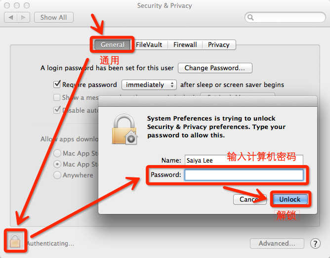
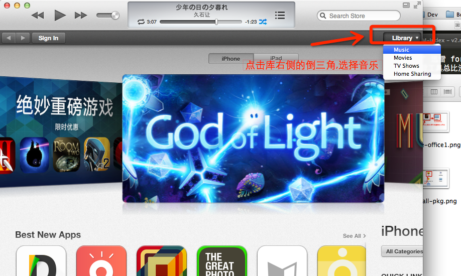
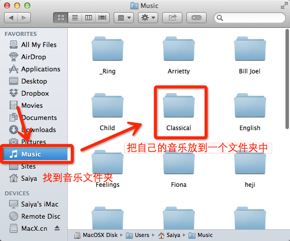
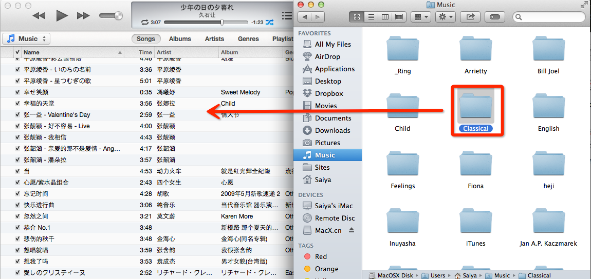
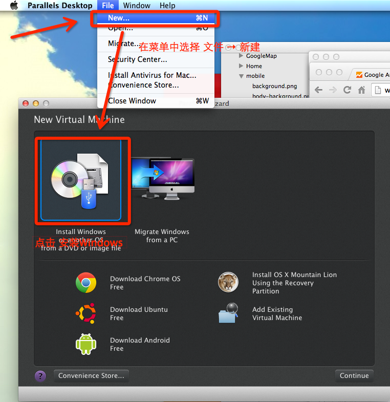
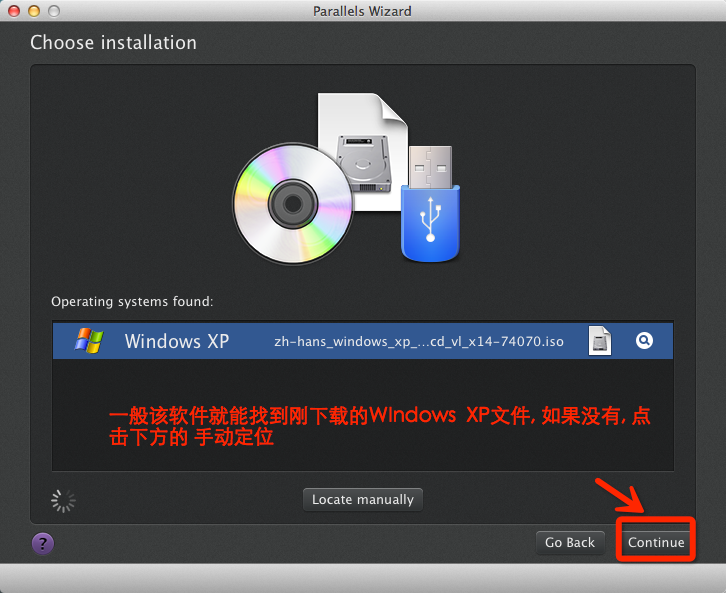
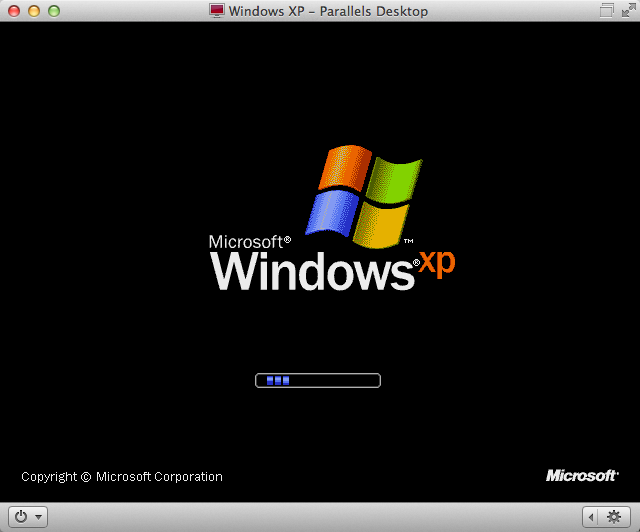

电脑才修好, 明天得加半天班, 只能明晚好好更新了.（由于本人电脑已经被弄坏了，待修复，未能下述问题的详细解决方法，请见谅。稍后更新，会有图有真相的:）

# 苹果Mac电脑使用常见问题

## 安装软件
mac下安装软件很方便, 通常是双击打开一个dmg文件,然后将应用图标拖拽到`应用程序`文件上就OK了,如下图所示.

当然, 也不全是这样, 但是一般打开dmg文件, 就会看到安装方法提示.

**注意** Mac并不支持Windows上的软件，不要试图双击EXE等文件去安装，Mac只会把它当作压缩文件来对待。

对于在dmg里的或者直接下载到的`pkg`格式的应用, 不能直接拖拽到应用程序文件夹中, 直接双击即可安装, 如下图所示.

软件安装后,按`F4`或者使用`五指向内抓`的手势进入launchpad,找到刚安装的软件,双击就可以打开了.

顺利的话, 你可以直接打开, 可是有时候可能会提示`文件已损坏,打不开. 您应该将它移动到废纸篓.`, 还有时候会提示`打不开xxx,因为它不是从 Mac App Store下载的`,遇到这个问题不要紧张, 这是由于苹果的默认的安全限制, 不予许安装或运行未经审核或者有安全隐患的软件. 首先你要确定你下载的软件的安全性, 然后安装下图的操作, 使计算机可以安装和运行任何来源的软件.

## 压缩软件
Mac OS X操作系统自带了压缩软件，功能很完善，但是对来自Windows的压缩文件支持不太好. 推荐使用Keka压缩软件，下载地址 <http://www.kekaosx.com/zh-cn/>  ，点击页面左侧的下载按钮下载安装即可。

## 下载工具
目前迅雷也为Mac用户推出了 迅雷 for Mac, 下载地址： <http://mac.xunlei.com/> 。迅雷越来越坑，但是有下载工具总比没有强。 

## 中文字体以及Office

Mac上却上很多Windows上常见的中文字体，这对编辑中文文档带来了不便。而且，iWork套件虽然也是非常棒的软件，很容易上手，能用来编辑并生成精美的文档，完胜Office。但是，大多数人都是使用Office来编辑文档，iWork套件也可以编辑Office的文档，但是毕竟还是有些差异。幸好微软推出了Office for Mac，不仅可以完美编辑Office文档，还可以为Mac添加Windows上常用的中文字体。该软件是付费软件，点此下载并安装office <http://url.cn/VDX0EW>, 点击下载激活文件<http://url.cn/VcoJzk>,激活方法如下。

## 读写U盘
一般U盘插入Mac后，只能从Mac读U盘中的文件，但是不能向U盘中存文件。 苹果是故意不支持的，很坑人。不过有软件可以让Mac支持读写U盘，安装软件Paragon NTFS for Mac即可，该软件付费软件，点此下载破解的免费版 http://url.cn/P2C0Ox 。安装和破解方法如下.

安装和激活过程中遇到问题, 请查看`安装软件`

## 听音乐
把自己的音乐放到`音乐`文件夹下, 最好在其中新建文件夹,把音乐放到该文件夹中.打开iTunes, 切换到库(第一次打开会有一步步的引导), 在切换到音乐, 将文件夹拖到列表中即可,然后就可以听音乐了,如下图所示.

要下载音乐的话,可以上百度音乐<http://music.baidu.com/>下载, 也可以通过其他方法, 稍后揭晓. PS, 上音悦台<http://www.yinyuetai.com/>可以看MV.

还可以使用QQ音乐mac版<http://y.qq.com/#type=down&p=detail> 或者酷狗音乐mac版<http://download.kugou.com/mac.html>, 他们都可以音乐, 但是不能把音乐下载到本地.

## 看视频
mac自带的视频播放器是Quiktime,它支持的格式不多,而且功能不够强大,推荐安装MPlayerX<http://mplayerx.org/download.html>.

## 远程连接
要和Windows远程连接, 请使用跨平台的 TeamViewer<http://www.teamviewer.com/zhCN/>, 需要对方也安装该软件.

## 禁止电脑自动睡眠
Mac长时间不操作会自动睡眠, 如果不希望电脑睡眠, 可以使用Caffeine<https://itunes.apple.com/cn/app/caffeine/id411246225?mt=12>. 运行该软件, 点击电脑顶部该软件图标, 是图标从灰色变成黑色即可.

## 网银使用问题

最开始，国内银行的网上银行几乎没有支持Mac电脑。现在，随着Mac电脑的普及，银行开始对Mac进行支持了。

已知的有招商银行、中国银行支持Mac，在它们的网银登录界面的密码框下可以看到支付控件下载链接，下载控件，安装，重启浏览器即可登录网银进行交易。平安银行也支持Mac，也有相应的支付控件，但是目前还有问题，安装控件后并不能登录网银。所以，要是使用平安银行的网易，无需安装控件，点击密码框后的键盘图标，然后在弹出的小键盘中点击输入密码即可。

常用的网络银行如支付宝和财付通都已支持Mac，在其官网下载相应控件，安装并重启浏览器即可！

PS. 由于Safari浏览器的安全策略，初次打开银行的登录页面时，会弹出提示框询问是否加载插件，点击信任，然后刷新页面即可。

对于其他网银，如果当前还没有支持Mac，那就只能使用Windows电脑了。

别气馁，在Mac上就可以直接使用Windows, 这需要安装其他软件(即虚拟机).

下载软件`Parallels Desktop`<http://url.cn/KxEouh> 并安装, 再下载`Windows XP`<http://url.cn/RzkMe3>. 先运行`Parallels Desktop`,使用`Parallels Desktop`安装Windows XP的方法如图下图所示.

然后无需其他特别设置, 点下一步, 就会自动安装Windows XP了,安装过程中会需要输入Windows XP的激活码, 输入该密钥即可`MRX3F-47B9T-2487J-KWKMF-RPWBY`,然后就只等他完成安装了.

安装完成后, 桌面上便会多出一个`Windows XP`的图标, 双击它就可以运行Windows XP啦, 如下图所示.

使用它和真的Windows XP是一模一样的! 推荐更新IE8<http://www.microsoft.com/ie>, 安装QQ电脑管家<http://guanjia.qq.com/>, 不要装360,不然电脑会很卡. 电脑也可以正常安装系统其他安全更新.

使用Windows XP就可以用网银了, 也可以用QQ音乐,酷狗音乐之类的软件下载音乐, 然后将音乐移动到Mac上的音乐文件夹下, 再拖到iTunes里.

## 紧急情况的处理
如果Mac电脑出了问题，无法进入系统，可选以下三种方案解决：

1. 将电脑拿到附近的Apple Store，让工作人员帮忙修复，记得提醒他们保护好自己的文档。
* 找我
* ①关闭电脑. ②开机，屏幕亮后立刻按住COMMAND + R 直至出现苹果logo. ③进入的画面中选择 重新安装 OS X. 该方法是从苹果服务器上下载整个OS X系统(4.6G之多)，然后修复本机的系统，非常耗时。

所以，使用电脑时需要小心，不要随意安装自己不清楚的软件，尤其是那些提示输入计算机密码即需要授权的软件;也不要尝试去删除自己不清楚的系统文件;更不要听信优化软件去清理电脑，我已经被坑两次了，导致电脑无法启动，坑=_=

## 其他问题
如有其他问题，请谷歌之，也欢迎留言提问。
